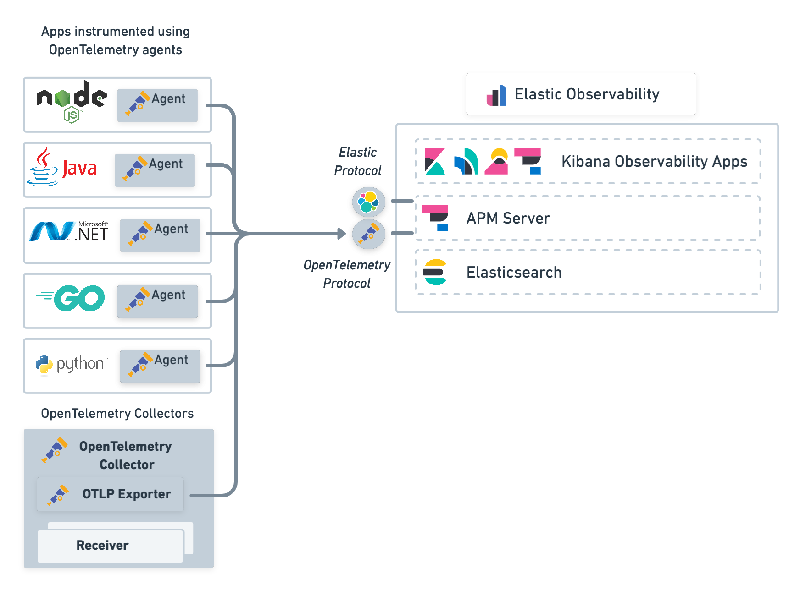

# What is it
OpenTelemetry is a collection of tools, APIs, and SDKs. Use it to instrument, generate, collect, and export telemetry data (metrics, logs, and traces) to help you analyze your software’s performance and behavior.

# types
- trace
- metric
- log

# general arch solution
- back end persistence , e.g DB, ELK
- data collector, e.g APM server, Jaeger collector
- instrument client app with agent which connect to collector and pull/push tracing data with it
- 

# reference
> Elastic APM Server natively supports the OpenTelemetry protocol. This means trace data and metrics collected from your applications and infrastructure can be sent directly to Elastic APM Server using the OpenTelemetry protocol. (https://www.elastic.co/guide/en/apm/guide/current/open-telemetry.html)

# settings 
# pipeline config
# instrument application
## java 
(https://opentelemetry.io/docs/instrumentation/java/)
## trace object
### trace provider
### span processor
### property define
### sampler

